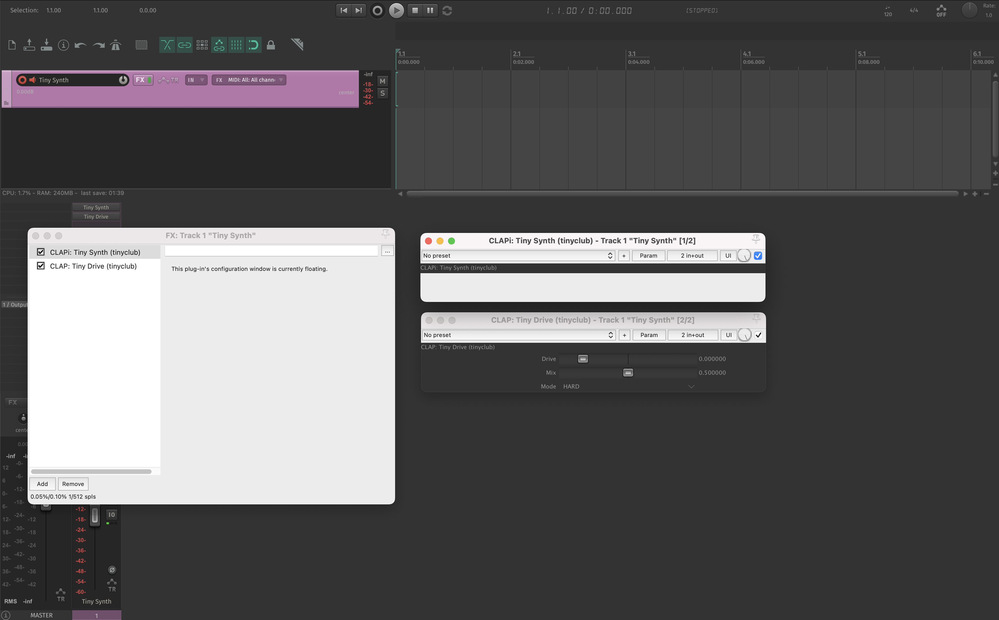

# 🎵 Tiny Audio
*A collection of tiny audio plugins for music creation *

## Description
Tiny Audio is a collection of [CLAP](https://cleveraudio.org/) audio plugins for music production written in C. These

## Features
- ∿ Sine wave synthesizer
- 🔉 Gain audio effect
- 📚 Install all plugins from a single file
- ☑ Supports MacOS, Windows & Linux
- 💾 Written in C99 with minimal dependencies
- 🔨 Simple build using unity build

## Potential Improvements
- Custom interface using SDL
- More plugins
- Hot-reloading using dynamic library

## Out of Scope
- Support for VST or AU plugins

## Development

1. Install dependencies with `./scripts/install.sh`
2. Build using `./scripts/build.sh`
3. Import in your favourite Digital Audio Workstation (must support CLAP)

## Tech stack
- C99
- CLAP
- SDL

